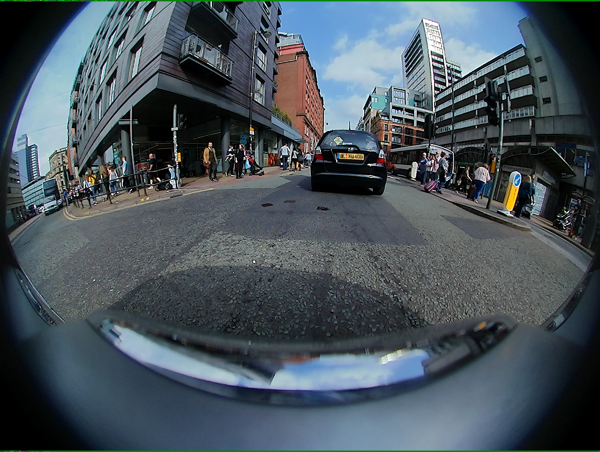

{
  "image": "rgb_images/00000_FV.png",
  "model": "HuggingFaceTB/SmolVLM-500M-Instruct",
  "device": "mps",
  "response_prefill": "{\"weather\":\"",
  "raw_response": "{\"weather\":\"clear\",\"lighting\":\"day\",\"road_type\":\"urban\",\"traffic_density\":\"low\"}",
  "raw_response_attempts": [
    "{\"weather\":\"clear\", \"lighting\":\"day\", \"road_type\": \"urban\", \"traffic_density\": \"low\", \"traffic_density\": \"high\", \"traffic_density\": \"low\", \"traffic_density\": \"high\", \"traffic_density\": \"low\", \"traffic_density\": \"high\", \"traffic_density\": \"low\", \"traffic_density\": \"high\", \"traffic_density\": \"low\", \"traffic_density\": \"high\", \"traffic_density\": \"low\", \"traffic_density\": \"high\", \"traffic_density\": \"low\", \"traffic_density\": \"high\", \"",
    "{\"weather\":\"clear\",\"lighting\":\"day\",\"road_type\":\"urban\",\"traffic_density\":\"low\"}"
  ],
  "parsed_json": {
    "weather": "clear",
    "lighting": "day",
    "road_type": "urban",
    "traffic_density": "low"
  },
  "parsing_error": null,
  "inference_error": null,
  "elapsed_seconds": 43.216
}

